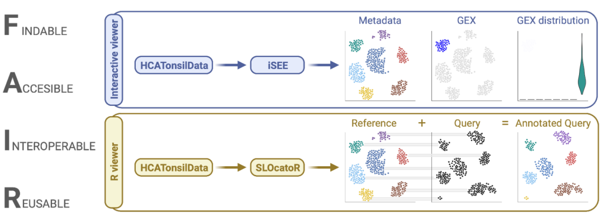

# SLOcatoR

The goal of SLOcatoR is to annotate and visualize single-cell gene expression or chromatin accessibility profiles from secondary lymphoid organs (SLO) using the tonsil atlas as reference.

SLOcatoR is under active development. For now, we have packages the functions we used in our project to connect the different data modalities and to annotate cells from the tumor microenvironment of mantle cell lymphoma (MCL). You can see two vignettes from the code release of the publication to see how SLOcatoR works:

* [Annotation of CD4 T cells from MCL](https://htmlpreview.github.io/?https://github.com/Single-Cell-Genomics-Group-CNAG-CRG/TonsilAtlas/blob/main/MCL/4-SLOcatoR/reports/01-CD4_T_label_transfer_102.html)
* [Transfer annotation and UMAP coordinates from RNA to CITE-seq in CD8 T cells](https://htmlpreview.github.io/?https://github.com/Single-Cell-Genomics-Group-CNAG-CRG/TonsilAtlas/blob/main/CITE-seq/harmonize_seurat_objects/harmonize_CD8_T_cite_seq.html)


Our purpose is to make SLOcatoR a natural companion to [HCATonsilData](https://github.com/massonix/HCATonsilData). Users will download their references of interest from our tonsil atlas using HCATonsilData, and then SLOcatoR will serve them to annotate their own cell types of interest. To that end: we will rewrite SLOcatoR in a BioConductor-friendly manner, and aim to submit it for the release 3.16 of BioC.




## Installation

You can install the development version of SLOcatoR from [GitHub](https://github.com/) with:

``` r
# install.packages("devtools")
devtools::install_github("massonix/SLOcatoR")
```


## Contact

If you have any doubts or suggestions feel free to contact us by [email](ramon.massoni@cnag.crg.eu) or on [twitter](https://twitter.com/rmassonix).
